# Taipei Travel Guide Based on My Own Trip

I wanted to share a Taipei travel guide based on my own trip, in case it helps with planning. Overall, Taipei is a very convenient city for free travel. Public transportation is easy to use, the city is lively, and there are many places worth visiting. What I liked most was that the trip could include a good mix of city spots, old streets, night markets, and nearby scenic areas.

During my trip, I visited several famous places in and around Taipei, including Taipei 101, Ximending, Jiufen, Shifen Old Street, Tamsui, and a number of night markets such as Shilin Night Market, Raohe Street Night Market, Ningxia Night Market, and Linjiang Street Night Market. If it is your first time visiting Taipei, I think these places give a very complete experience of the city.

## 1. Taipei 101

Taipei 101 is one of the most iconic landmarks in Taipei, so I think it is definitely worth visiting at least once. The area feels modern and energetic, and there are also many shops and restaurants nearby. It is a good place to walk around during the day or in the evening. If the weather is nice, it is also a great spot for photos.

For me, Taipei 101 felt more like a landmark and city experience rather than a place to spend the whole day, so I would suggest combining it with other places nearby.
   
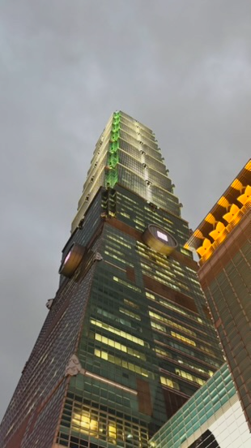
  
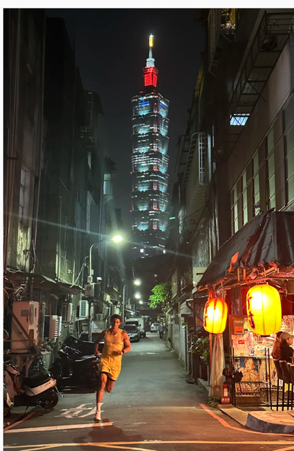  

The location if above image is https://maps.app.goo.gl/M5ShbdL2TiXBtdPm7
## 2. Ximending
Location ： https://maps.app.goo.gl/cgKQkqx9nQefe6eS8  

Ximending is one of the liveliest areas in Taipei. It has a very youthful atmosphere, with lots of shops, restaurants, street food, and people walking around. If you want to experience a busy and trendy side of Taipei, this is a good place to go.

I think Ximending is especially nice in the evening, because the lights, the crowds, and the street atmosphere make it feel very lively. It is also a good place to shop a little, try snacks, and just enjoy the city vibe.  

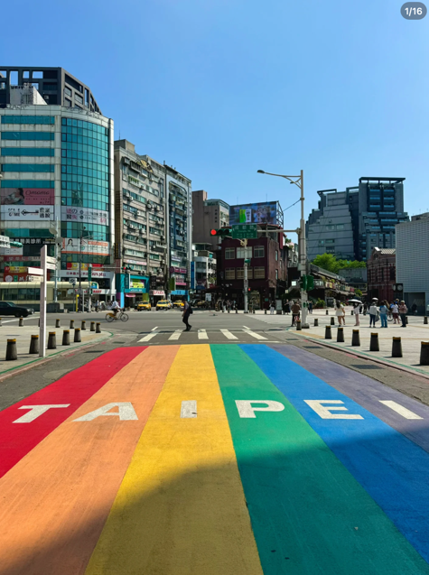 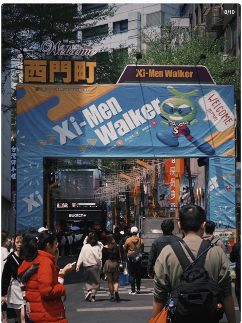
## 3. Jiufen
Location ：https://maps.app.goo.gl/G4QhbK7UGerXDHGT8
Jiufen was one of the most memorable places on my trip. It is a hillside old town with narrow lanes, local snacks, tea houses, and beautiful views. The atmosphere there feels very special, a bit nostalgic and very different from central Taipei.

I would strongly recommend Jiufen for first-time visitors. It is a great place to walk slowly, try local food, and enjoy the scenery. In my opinion, it becomes even more beautiful in the late afternoon and evening, when the lights start to come on.
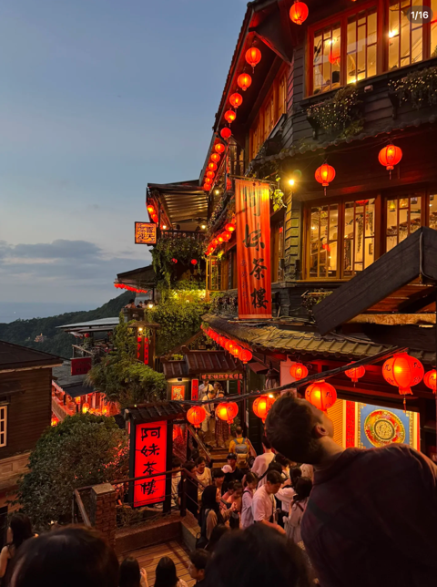
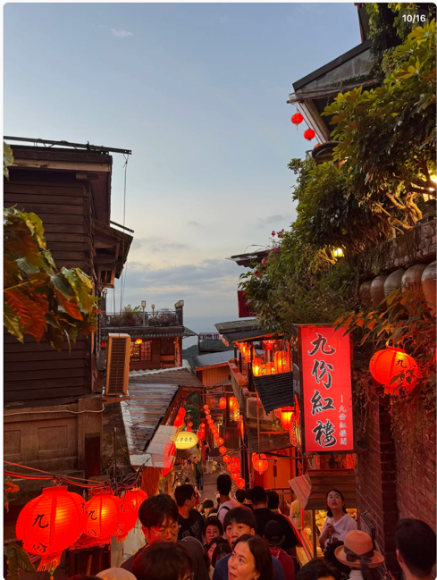
## 4. Shifen Old Street
Location ：https://maps.app.goo.gl/oozm8Y2S3Uys1yLa6
Shifen Old Street can be visited together with Jiufen on the same day. It is a smaller old street area, but it has its own charm. One of the most famous activities there is releasing a sky lantern on the railway tracks, which many visitors enjoy.

Compared with Jiufen, Shifen feels simpler and more relaxed, but it is still very worth visiting. It is a nice place to walk around, take photos, and experience a different side of Taiwan’s old street culture.
One of the most popular activities in Shifen is releasing a sky lantern. You can write your wishes or messages on the lantern and let it go, which makes the visit feel very special and memorable. It’s one of the most iconic experiences there and something many visitors really enjoy.  

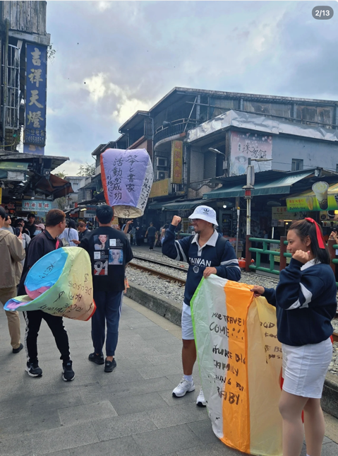
## 5. Tamsui
Location ：https://maps.app.goo.gl/WTHgKJMG23u1SwnV8
Tamsui is another place I really liked. It has a much slower and more relaxed atmosphere compared with the city center. There is the old street area, the riverside, and a very comfortable environment for walking around.

I think Tamsui is especially good for the late afternoon or evening. You can walk along the river, enjoy snacks on Tamsui Old Street, and take your time. It is not the kind of place where you need to rush from one attraction to another. It is better to enjoy it slowly.
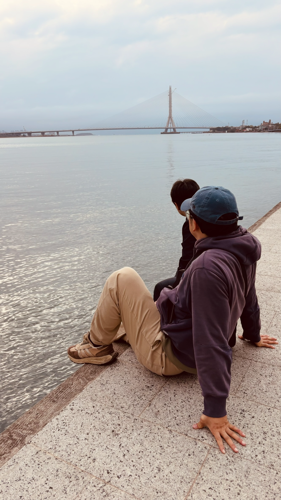
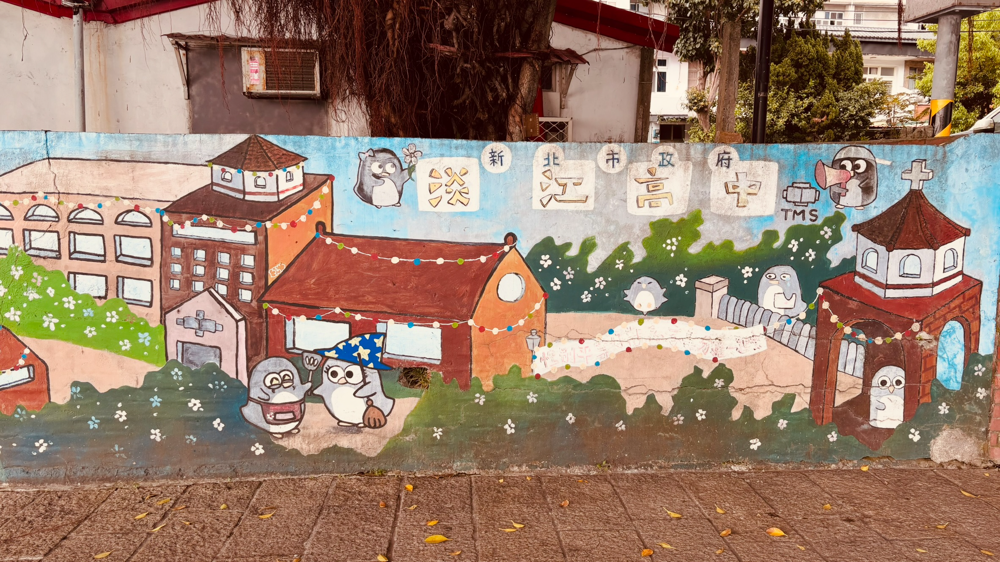
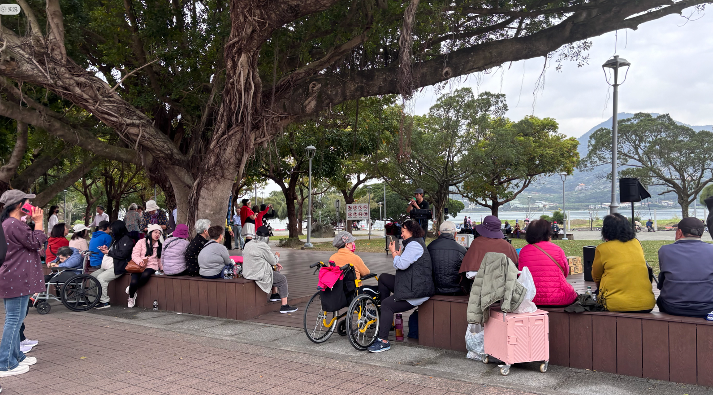
## 6. Night Markets in Taipei

One of the best parts of Taipei is definitely its night markets. I visited several of them, and each one had a different atmosphere.

Shilin Night Market
Location ：https://maps.app.goo.gl/CwcQVSuNKXuAy3687
Shilin Night Market is probably the most famous and classic night market in Taipei. It is large, busy, and full of energy. There are many kinds of food, but also shops, small games, and different stalls. If someone is visiting Taipei for the first time and only wants to visit one night market, I think Shilin is the safest choice because it is the most iconic and has a little bit of everything.

### Raohe Street Night Market
https://maps.app.goo.gl/RQeesxbhKuWDSaZy7

Raohe Street Night Market is easier to walk through because the street layout is very straightforward. You can more or less just walk from one end to the other. That makes it a good choice if you want a relaxed and simple night market experience. It is great for food, casual walking, and photos in the evening.  

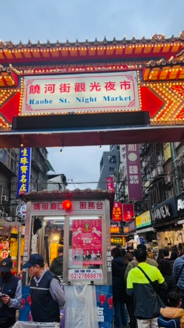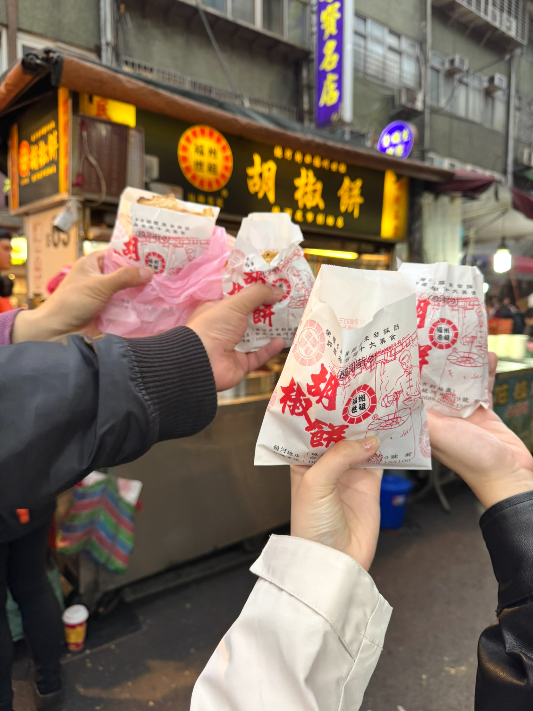
### Ningxia Night Market
Location ：https://maps.app.goo.gl/rLsC9jhucRRcUWKW7
Ningxia Night Market feels more food-focused. It is not as large as Shilin, but the food stalls are very concentrated, so it is a great place if your main goal is to eat. If you care more about trying local snacks than shopping, this one is very worth visiting.  

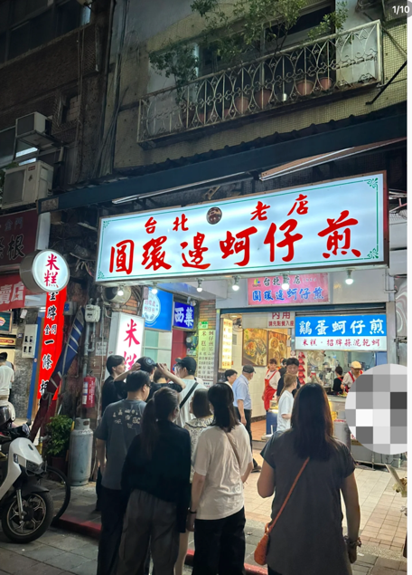
### Linjiang Street Night Market
Location ：https://maps.app.goo.gl/9s6wRw8DXjA4R4vg8
Linjiang Street Night Market, also known as Tonghua Night Market, feels a bit more local. It is not as huge or crowded as Shilin, and I think it gives more of an everyday local atmosphere. If you prefer a slightly more relaxed and less touristy experience, this is a good option.

## 7. Suggested Itinerary

If I had to suggest a simple plan, I would recommend something like this:

### Day 1: City Highlights

Visit Taipei 101 during the day, then go to Ximending in the evening. This is a good way to start the trip with a modern and lively side of Taipei.

### Day 2: Jiufen and Shifen

Take a day trip to Shifen Old Street and Jiufen. I think these two places work very well together. Shifen is good for a more relaxed old street experience, while Jiufen has a more scenic and atmospheric feeling.

### Day 3: Tamsui and a Night Market

Spend the afternoon in Tamsui, walk around Tamsui Old Street, and enjoy the riverside atmosphere. In the evening, go back to the city or visit another night market such as Shilin Night Market, Raohe Street Night Market, or Ningxia Night Market.

## 8. Final Thoughts

Overall, I think Taipei is a great destination for a short trip. It is easy to get around, there is a lot of good food, and the city offers a nice balance between urban sightseeing and cultural day trips.

What I personally enjoyed most were Ximending， Tamsui, and the different night markets, because they gave me a stronger feeling of local culture and travel atmosphere. At the same time, places like Taipei 101 and Ximending are great for experiencing the modern and energetic side of the city.  

Also, one more thing I’d recommend in Taipei is getting a massage. Massage shops in Taiwan are usually quite affordable, so if you feel tired after walking around all day, it’s a really nice way to relax. A full-body massage can be a good option, especially after visiting places like Jiufen, Shifen, or the night markets.  

For hotels, I’d recommend staying near Taipei Main Station. It’s a very convenient area for transportation, and it’s easy to get to most places from there. If you stay around Taipei Main Station, traveling to different parts of the city and even doing day trips feels much easier.
- https://maps.app.goo.gl/P4KqNfd1r2Q96oiMA   

If you want to visit the cookie shop where I bought the biscuits for you, the store is called L’Atelier Lotus (甜滿), and the address is No. 10, Lane 31, Yongkang Street, Da’an District, Taipei City. It’s a well-known souvenir shop in the Yongkang Street area.  
- https://maps.app.goo.gl/J28JmKjnJZ2wMs6y5